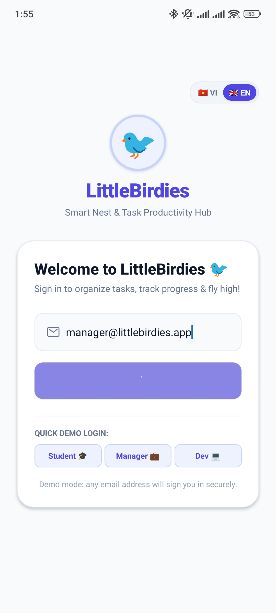
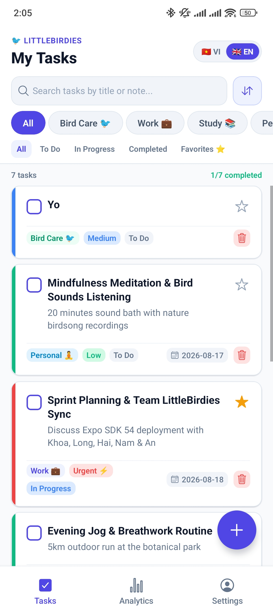
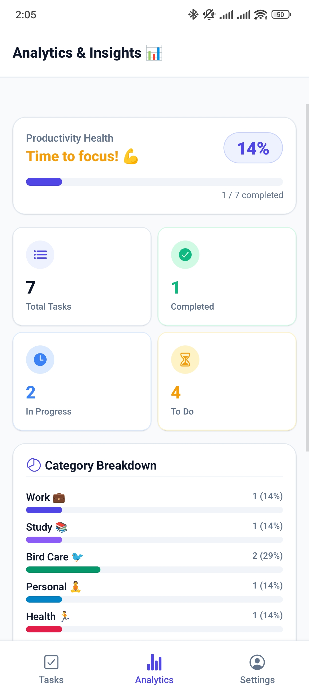
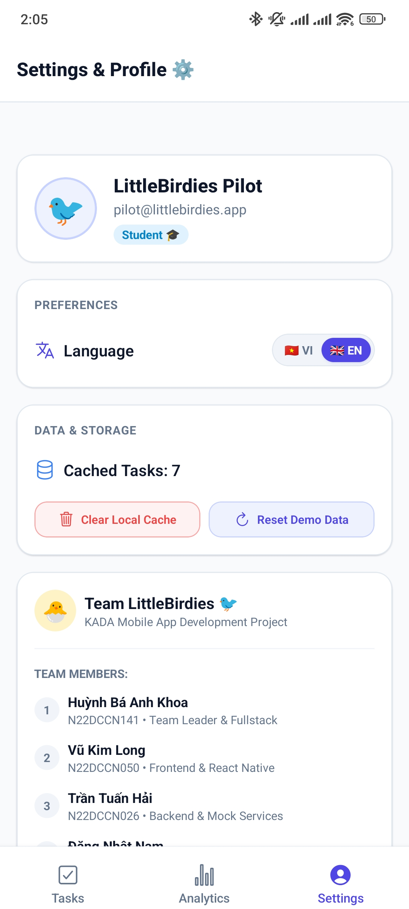

# 🐦 LittleBirdies — Smart Nest & Task Productivity Hub

> **Dự án KADA Mobile App Development**  
> **Nhóm thực hiện**: `Team_LittleBirdies`

---

## 👥 Danh sách thành viên nhóm (Team Members)

| STT | Họ và Tên | MSSV |
| 1 | **Huỳnh Bá Anh Khoa** | `N22DCCN141` |
| 2 | **Vũ Kim Long** | `N22DCCN050` |
| 3 | **Trần Tuấn Hải** | `N22DCCN026` |
| 4 | **Đặng Nhật Nam** | `N22DCDT038` |
| 5 | **Tạ Quang An** | `N22DCAT003` |

---

## 📱 Giới thiệu Ứng dụng (Overview)

**LittleBirdies** là ứng dụng di động quản lý công việc và hoạt động thông minh, tối ưu hóa năng suất cho cá nhân và đội nhóm:
- 💼 **Phân loại đa dạng**: Hỗ trợ 6 danh mục chính: Công việc (Work 💼), Học tập (Study 📚), Chăm sóc chim cảnh (Bird Care 🐦), Cá nhân (Personal 🧘), Sức khỏe (Health 🏃), Tài chính (Finance 💰).
- ⚡ **Hệ thống độ ưu tiên 4 cấp**: Khẩn cấp (Urgent ⚡), Cao (High), Trung bình (Medium), Thấp (Low) với mã màu phân biệt trực quan.
- 📊 **Thống kê KPI & Năng suất**: Theo dõi tỉ lệ hoàn thành nhiệm vụ, phân bổ khối lượng công việc theo danh mục và độ ưu tiên theo thời gian thực.
- 💾 **Kiến trúc Offline-First**: Lưu trữ và đồng bộ dữ liệu đệm mượt mà qua `AsyncStorage`, thao tác tức thời (Optimistic UI) không lo giật lag hay mất mạng.
- 🌐 **Đa ngôn ngữ toàn diện**: Chuyển đổi linh hoạt song ngữ Tiếng Việt (🇻🇳 VI) và Tiếng Anh (🇬🇧 EN).
- ✨ **Giao diện hiện đại**: Thiết kế bo góc chuẩn mực, bóng mờ tinh tế, thanh lọc chip ngang, thanh tìm kiếm nhanh, nút Floating Action Button (FAB) tiện lợi.

---

## 📸 Hình ảnh Giao diện Ứng dụng (Screenshots)

| **1. Màn hình Đăng nhập (Login)** | **2. Danh sách Công việc (Tasks)** |
| :---: | :---: |
|  |  |
| *Giao diện đăng nhập thân thiện, hỗ trợ đăng nhập nhanh tài khoản mẫu (Student/Manager/Dev) và chuyển đổi ngôn ngữ song ngữ.* | *Danh sách nhiệm vụ trực quan, hỗ trợ tìm kiếm tức thời, thanh lọc chip danh mục, lọc trạng thái, gắn sao yêu thích và nút FAB tiện lợi.* |

| **3. Thống kê & Năng suất (Analytics)** | **4. Cài đặt & Nhóm (Settings)** |
| :---: | :---: |
|  |  |
| *Bảng thống kê KPI, theo dõi điểm năng suất (Productivity Health) và biểu đồ phân bổ khối lượng công việc theo danh mục & độ ưu tiên.* | *Hồ sơ người dùng, tùy chọn đổi ngôn ngữ EN/VI, công cụ quản lý bộ nhớ đệm AsyncStorage và thông tin thành viên Team_LittleBirdies.* |


## 🚀 Hướng dẫn Cài đặt & Chạy Ứng dụng (Quick Start)

### 1. Khởi chạy đồng thời cả Mock Backend & Expo App (Chỉ 1 lệnh)
Mở terminal tại thư mục `reference-app`:
```bash
cd reference-app
npm install
npm start
```
*Lệnh trên sẽ tự động bật đồng thời cả Mock Backend (Port 5000) và Expo Metro Bundler.*

- Nhấn `w` để mở giao diện Web trên trình duyệt.
- Nhấn `a` để mở trên Android Emulator.
- Nhấn `i` để mở trên iOS Simulator.
- Hoặc quét mã QR qua ứng dụng **Expo Go** trên điện thoại thật.

---

## 📂 Cấu trúc Tài liệu Dự án (`docs/`)

Toàn bộ tài liệu kỹ thuật, nghiệp vụ và sơ đồ hệ thống được tổ chức chuẩn hóa:

```
docs/
├── project-brief.md       # Tổng quan dự án, tech stack, mục tiêu & checklist sơ đồ
├── technical.md           # Quy chuẩn kỹ thuật, RN best practices, offline-cache & performance
├── business.md            # Danh sách tính năng đang phát triển (FEATURE #N)
├── Done.md                # Lịch sử các tính năng đã hoàn thành & verify ([x] Verified)
├── bug.md                 # Nhật ký lỗi đang xử lý (BUG #N)
├── bugdone.md             # Lịch sử các lỗi đã fix & nghiệm thu
└── diagrams/              # Thư mục chứa 6 sơ đồ kiến trúc Mermaid
    ├── architecture.mmd   # Kiến trúc Client - Service - Offline Cache - Backend
    ├── sequence-auth.mmd  # Luồng xác thực đăng nhập & lưu trữ token
    ├── sequence-item-flow.mmd # Luồng CRUD công việc & cập nhật lạc quan
    ├── navigation.mmd     # Sơ đồ điều hướng Expo Router (Stacks & Tabs)
    ├── data-flow.mmd      # Vòng đời dữ liệu giữa UI, Cache & REST API
    └── er.mmd             # Mô hình quan hệ thực thể (ER Diagram)
```

---

## 🔗 Liên kết Nhanh (Quick Links)

- [📄 Đọc Project Brief](docs/project-brief.md)
- [⚙️ Đọc Technical Best Practices](docs/technical.md)
- [📋 Đọc Business Active Features](docs/business.md)
- [✅ Đọc Done Verified Features](docs/Done.md)
- [🐛 Đọc Bug Tracking](docs/bug.md)
- [🛠️ Đọc Verified Bug Archive](docs/bugdone.md)
- [🖼️ Xem Thư mục Sơ đồ Hệ thống](docs/diagrams/)
